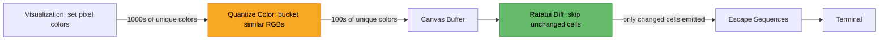
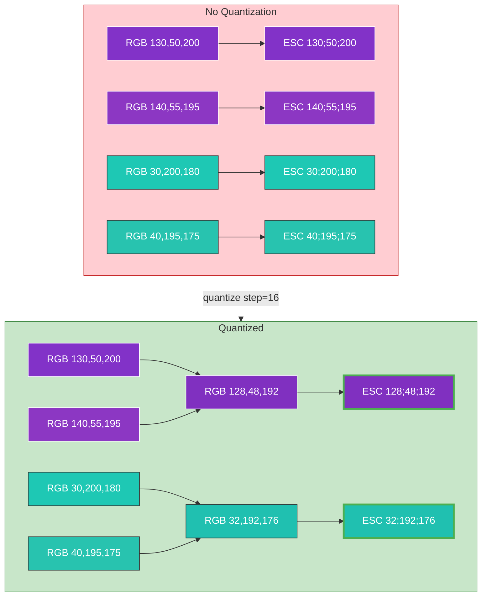
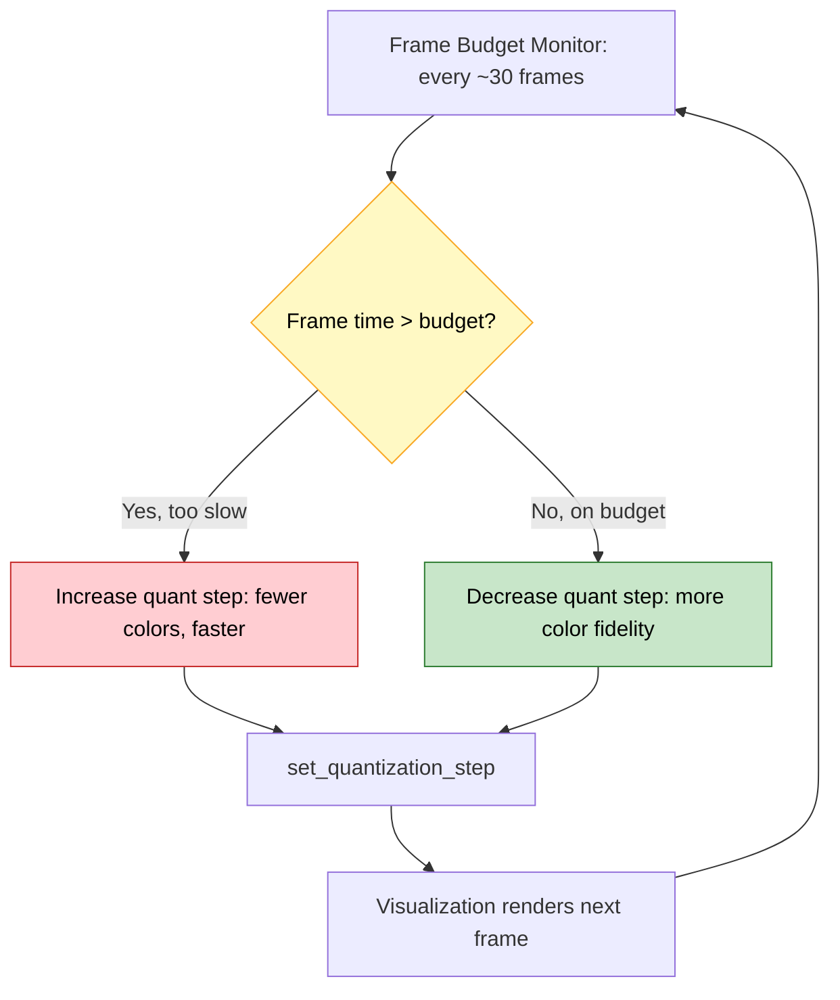

```
░░░░░░░░░░░░░░░░░░░░░░░░░░░░░░░░░░░░░░░░░░░░░░░░░░░░░░░░░░░░░░░░░░░░░░░░░░░░░░░░
░▒▓██████████████████████████████████████████████████████████████████████████▓▒░
░▓                                                                            ▓░
░▓   ████████ ████████ ███████  ██     ██ ██ ██    ██  ██████  ██             ▓░
░▓      ██    ██       ██   ██  ███   ███ ██ ███   ██ ██    ██ ██             ▓░
░▓      ██    ██████   ███████  ██ █ █ ██ ██ ██ █  ██ ████████ ██             ▓░
░▓      ██    ██       ██  ██   ██  █  ██ ██ ██  █ ██ ██    ██ ██             ▓░
░▓      ██    ████████ ██   ██  ██     ██ ██ ██   ███ ██    ██ ████████       ▓░
░▓                                                                            ▓░
░▓  ░░░░░░░░░░░░░░░░░░░░░░░░░░░░░░░░░░░░░░░░░░░░░░░░░░░░░░░░░░░░░░░░░░░░░░░░  ▓░
░▓  ░▒▒▒▒▒▒▒▒▒▒▒▒▒▒▒▒▒▒▒▒▒▒▒▒▒▒▒▒▒▒▒▒▒▒▒▒▒▒▒▒▒▒▒▒▒▒▒▒▒▒▒▒▒▒▒▒▒▒▒▒▒▒▒▒▒▒▒▒▒▒░  ▓░
░▓  ░▒                ██    ██ ██ ██████  ████████  ██████                ▒░  ▓░
░▓  ░▒                ██    ██ ██ ██   ██ ██       ██                     ▒░  ▓░
░▓  ░▒                 ██  ██  ██ ██████  █████     █████                 ▒░  ▓░
░▓  ░▒                  ████   ██ ██   ██ ██            ██                ▒░  ▓░
░▓  ░▒                   ██    ██ ██████  ████████ ██████                 ▒░  ▓░
░▓  ░▒▒▒▒▒▒▒▒▒▒▒▒▒▒▒▒▒▒▒▒▒▒▒▒▒▒▒▒▒▒▒▒▒▒▒▒▒▒▒▒▒▒▒▒▒▒▒▒▒▒▒▒▒▒▒▒▒▒▒▒▒▒▒▒▒▒▒▒▒▒░  ▓░
░▓  ░░░░░░░░░░░░░░░░░░░░░░░░░░░░░░░░░░░░░░░░░░░░░░░░░░░░░░░░░░░░░░░░░░░░░░░░  ▓░
░▓                                                                            ▓░
░▓    ·── ♪ ♫  real-time audio visualizer for your terminal  ♫ ♪ ──·          ▓░
░▓                                                                            ▓░
░▓          ▄▄▄▄▄▄▄▄▄▄▄▄▄▄▄▄▄▄▄▄▄▄▄▄▄▄▄▄▄▄▄▄▄▄▄▄▄▄▄▄▄▄▄▄▄▄▄▄▄▄▄▄▄▄▄▄          ▓░
░▓          █ macOS · Windows · Linux · ratatui  ·  12 modes    █          ▓░
░▓          █ beat detect ·  60 fps  ·  braille + halfblock art    █          ▓░
░▓          ▀▀▀▀▀▀▀▀▀▀▀▀▀▀▀▀▀▀▀▀▀▀▀▀▀▀▀▀▀▀▀▀▀▀▀▀▀▀▀▀▀▀▀▀▀▀▀▀▀▀▀▀▀▀▀▀          ▓░
░▓                                                                            ▓░
░▓     sysop: joelmgallant       ░▒▓█▓▒░       est. 2026  ·  rust lang        ▓░
░▓                                                                            ▓░
░▒▓██████████████████████████████████████████████████████████████████████████▓▒░
░░░░░░░░░░░░░░░░░░░░░░░░░░░░░░░░░░░░░░░░░░░░░░░░░░░░░░░░░░░░░░░░░░░░░░░░░░░░░░░░
```

A real-time terminal music visualizer. Captures system audio and renders 12 visualization modes directly in your terminal. Built with Rust and [ratatui](https://github.com/ratatui/ratatui).

https://github.com/user-attachments/assets/f05ef7fd-fa78-4616-abf4-30affbe15c41

## Platform Support

| Platform | Audio Backend | Status |
|----------|--------------|--------|
| **macOS 15+** | Core Audio `AudioProcessTap` | Tested |
| **Windows** | WASAPI loopback | Untested |
| **Linux** | PulseAudio / PipeWire | Untested |

Windows and Linux backends compile and pass CI, but have not been tested with real audio hardware yet. Contributions and bug reports welcome.

## Requirements

- Rust toolchain (1.70+)
- Terminal with true color support recommended
- **macOS:** macOS 15+ (Sequoia) for the `AudioProcessTap` API
- **Linux:** `libpulse-dev` (Debian/Ubuntu) or `pulseaudio-libs-devel` (Fedora). Works with PipeWire's PulseAudio compatibility layer.
- **tmux/byobu users:** enable true color passthrough (see [Terminal Multiplexers](#terminal-multiplexers))

## Install

```bash
cargo install terminal-vibes
```

Or build from source:

```bash
git clone https://github.com/joelmgallant/terminal-vibes.git
cd terminal-vibes
cargo build --release
```

## Usage

```bash
cargo run --release
```

Or after building:

```bash
./target/release/terminal-vibes
```

### Options

```
terminal-vibes [OPTIONS]

Options:
  --config <PATH>    Path to config file
  --list-modes       List available visualization modes
  -h, --help         Print help
```

## Visualizations

Switch between modes with **Tab** / **Shift+Tab**. The mode name fades in on switch then disappears after a few seconds.

### Spectrum Bars

Frequency spectrum with logarithmic band distribution and sub-block character resolution. 12 built-in color palettes.

| Key | Action |
|-----|--------|
| `p` / `P` | Next / previous color palette |
| `g` | Toggle bar gaps |
| `c` | Toggle chunky mode |
| `r` | Toggle color cycling |

**Palettes:** Neon, Fire, Ocean, Sunset, Matrix, Ice, GruvboxDark, GruvboxLight, Synthwave, Outrun, Retrowave, Pastel

### Waveform

Oscilloscope-style time-domain display with beat-reactive brightness.

### Spectrogram

Scrolling time-frequency heatmap with a magma colormap. Frequency on the vertical axis, time scrolling left to right.

### Lissajous

Parametric curve spirograph with 8 frequency ratios and braille-resolution rendering.

| Key | Action |
|-----|--------|
| `f` | Freeze / unfreeze ratio drift |
| `r` | Next ratio |

### Tunnel

Concentric rings rushing forward in 3 shape modes.

| Key | Action |
|-----|--------|
| `s` | Cycle shape (circle / hexagon / square) |
| `p` / `P` | Next / previous palette |

### Radial

Circular spectrum starburst — frequency rays radiating from center with beat-driven rotation.

| Key | Action |
|-----|--------|
| `m` | Toggle mirror mode |
| `p` / `P` | Next / previous palette |

### Plasma

Sine wave interference color field. Spectrum bands modulate wave frequencies, beats warp density and shift hue.

### Aurora

Northern lights curtains with flowing animation. Layered sine waves with HSV color cycling and shimmer.

| Key | Action |
|-----|--------|
| `l` | Cycle layer count (2 / 3 / 4) |

### Starfield

3D particle warp drive. Quiet = gentle drift, loud = warp speed, beat = hyperspace burst.

### Rain

Music-reactive falling streams. Per-column energy controls drop density, beats trigger storms.

| Key | Action |
|-----|--------|
| `t` | Toggle thickness (thin / thick) |
| `p` / `P` | Next / previous palette |

## Global Controls

| Key | Action |
|-----|--------|
| `Tab` / `Shift+Tab` | Next / previous visualization |
| `+` / `-` | Increase / decrease sensitivity |
| `b` / `B` | Increase / decrease beat intensity |
| `]` / `[` | Increase / decrease color detail (fidelity vs performance) |
| `s` | Toggle status bar |
| `H` | Toggle help overlay (per-mode keybinds) |
| `q` / `Ctrl+C` | Quit |

## Configuration

Configuration is loaded from `~/.config/terminal-vibes/config.toml` (respects `XDG_CONFIG_HOME`).

```toml
[audio]
fft_size = 2048
smoothing = 0.7
buffer_size = 4096

[display]
fps = 30
show_status_bar = true

[beat_detection]
sensitivity = 1.4
variance_scale = 1.0
envelope_decay = 0.95
cooldown_frames = 6
history_frames = 43

[visualizations.spectrum]
palette = "neon"
gap = false
chunky = true
cycling = false

[visualizations.spectrogram]
history_length = 200
```

All fields are optional — defaults are applied for anything not specified.

App state (current visualization, sensitivity, beat intensity, color detail, per-viz settings) is persisted across sessions in `~/.config/terminal-vibes/state.toml`.

## How It Works

Terminal-vibes runs a three-thread pipeline:

1. **Audio capture** — A platform-specific backend (Core Audio on macOS, WASAPI on Windows, PulseAudio on Linux) captures system audio and writes mono PCM samples into a lock-free ring buffer
2. **DSP processing** — A worker thread runs an FFT pipeline at ~60Hz (windowing, FFT, logarithmic band binning, smoothing) and produces frame data with beat detection
3. **Rendering** — The main thread runs a ratatui event loop at 60 FPS (30 FPS in tmux), drawing the active visualization to the terminal. A frame budget monitor auto-adjusts color detail to maintain smooth frame rates at any terminal size

The threads communicate via lock-free data structures (SPSC ring buffer, bounded channel) so the audio callback never blocks.

## Terminal Multiplexers

When running inside **tmux** or **byobu**, you must enable true color (RGB) passthrough. Without this, tmux converts RGB escape sequences to 256-color, which can cause crashes or severe slowdown with color-intensive visualizations (plasma, aurora, spectrogram, tunnel).

Add to your `~/.tmux.conf` (or byobu `profile.tmux`):

```bash
# Required: true color passthrough (prevents RGB-to-256color conversion crashes)
set -ga terminal-overrides ',xterm-256color:Tc'

# Required: focus events (lets terminal-vibes pause rendering when pane is inactive)
set -g focus-events on
```

Then reload: `tmux source-file ~/.tmux.conf`

terminal-vibes auto-detects tmux (`$TMUX` env var) and caps the frame rate at 30 FPS to keep escape sequence volume manageable. Full-screen color visualizations (plasma, aurora, tunnel) are marked as heavy renderers and **automatically pause when the pane loses focus**, preventing escape sequence floods during pane switching. Lightweight visualizations (spectrum, waveform, starfield, etc.) keep rendering normally in inactive panes.

This requires `focus-events on` in your tmux config.

## Contributing

Contributions welcome! The visualization plugin system is designed to make adding new modes straightforward.

### Adding a New Visualization

1. **Create your file** at `src/visualizations/your_viz.rs`
2. **Implement the `Visualization` trait** — see any existing viz for the pattern
3. **Register it** in `src/visualizations/mod.rs` (add `pub mod`) and `src/main.rs` (register in the registry)
4. **Add a test** in `tests/your_viz_test.rs`

### Rendering Approaches

There are two ways to render, depending on what you're building:

**Canvas-based** (for full-screen pixel effects like plasma, aurora, tunnel):
- Use `HalfBlockCanvas` (2x vertical resolution, fg+bg color per cell) or `BrailleCanvas` (2x4 dot matrix per cell)
- Call `self.canvas.resize_or_clear()` at the start of `render()`, then `self.canvas.set(x, y, color)` per pixel, then `self.canvas.render(&area, buf)`
- Implement `set_quantization_step` by delegating to `self.canvas.set_step(step)`
- Return `true` from `heavy_rendering()` — this enables auto-pause when the pane loses focus in tmux

**Direct buffer** (for simpler modes like spectrum bars, waveform, spectrogram):
- Write directly to ratatui's `Buffer` via `buf[(x, y)].set_char(...).set_fg(...)`
- Use `quantize_color(color, self.quant_step)` to reduce escape sequence volume
- Add a `quant_step: u8` field (init to `16`) and implement `set_quantization_step` to update it

### Why Color Detail Matters for Performance

Terminal rendering works by emitting ANSI escape sequences — each unique color requires a separate sequence like `\e[38;2;R;G;Bm`. When a visualization fills every cell with a slightly different RGB value, the terminal has to process thousands of unique escape sequences per frame. This is the dominant bottleneck, especially in terminal multiplexers like tmux where every escape sequence passes through an extra parsing layer.

#### Rendering Pipeline



Quantization and diffing are the two stages that reduce escape sequence volume — quantization makes more cells "look the same" to the differ, and the differ skips re-emitting unchanged cells.

#### Without vs With Color Quantization



Similar colors are nearly identical to human eyes, yet without quantization each generates a separate escape sequence. With quantization, nearby colors bucket together — 4 sequences become 2. At fullscreen that's thousands of sequences eliminated per frame.

#### Adaptive Quantization Feedback Loop



The `color_detail` control (`]`/`[`) lets you tune this tradeoff in real-time. Higher detail = more unique colors = more escape sequences = more CPU. Lower detail = fewer colors = fewer sequences = smoother rendering. The frame budget monitor handles this automatically, but manual control is there when you want it.

### Performance Tips

- Use `SIN_LUT.get(radians)` instead of `.sin()` for per-pixel trig — it's a pre-computed 4096-entry table with O(1) lookup
- Reuse buffers across frames — `canvas.resize_or_clear()` avoids allocation when the terminal size hasn't changed
- Color quantization happens at set-time in canvases, reducing the number of unique terminal escape sequences ratatui needs to emit
- The frame budget monitor will automatically coarsen color quantization if your viz is too expensive at large terminal sizes

### Audio Data Available

Your `update()` method receives `FrameData` with:
- `spectrum: Vec<f32>` — 128 log-spaced frequency bands (0.0–1.0)
- `waveform: Vec<f32>` — raw PCM samples
- `peak` / `rms` — amplitude metrics
- `beat.envelope` — overall beat envelope (0.0–1.0, smooth attack/decay)
- `beat.bass_envelope` / `mid_envelope` / `treble_envelope` — per-band envelopes
- `beat.beat` — true on beat onset frames
- `tempo.bpm` / `tempo.confidence` — estimated BPM

### Code Quality

- Run `cargo fmt`, `cargo clippy`, and `cargo test --lib` before submitting
- Pre-commit hooks enforce all three automatically

## License

MIT
